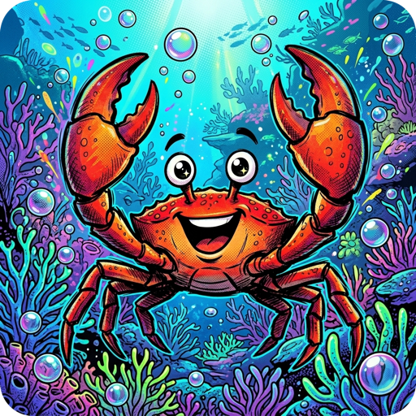

<p align="center">
    <a href="rusty-bubbles.png"></a><br>
    <a href="https://crates.io/crates/rusty-bubbles"></a>
    <a href="https://github.com/coderbants/rusty-bubbles/actions"></a>
</p>

# Rusty Bubbles (`rusty-bubbles`)

**Rusty Bubbles** is a complete, from-scratch Rust port of [Bubbles](https://github.com/charmbracelet/bubbles), the library of common UI components for Bubble Tea — text inputs, text areas, spinners, stopwatches, file pickers, help views, viewports and more. It tracks upstream Go releases on a rolling basis. **Version policy: the crate version and every release tag must equal the tracked upstream version exactly — never ahead, never behind** (enforced by `scripts/verify_upstream_version.sh` in CI and on every release). It holds a hard goal of **1:1 behavioural, visual and license parity**, favoring fidelity to upstream over Rust-native rewrites whenever the two would diverge.

It's part of the Rusty port family of the Bubble Tea ecosystem and builds on [rusty-bubbletea](https://github.com/coderbants/rusty-bubbletea), [rusty-lipgloss](https://github.com/coderbants/rusty-lipgloss) and [rusty-ultraviolet](https://github.com/coderbants/rusty-ultraviolet).

## Installation

```sh
cargo add rusty-bubbles
```


## Usage

Components follow the same [model/update/view](https://github.com/coderbants/rusty-bubbletea)
pattern as the framework they live in. Here's a complete spinner:

```rust
use rusty_bubbles::spinner;
use rusty_bubbletea::model::Model as ModelTrait;
use rusty_bubbletea::{quit, Cmd, KeyPressMsg, Msg, Program, View};

struct Model {
    spinner: spinner::Model,
}

impl ModelTrait for Model {
    fn init(&self) -> Cmd {
        // Kick off the spinner's tick loop.
        let tm = self.spinner.tick_msg();
        Some(Box::new(move || Some(Box::new(tm))))
    }

    fn update(&mut self, msg: &dyn Msg) -> Cmd {
        if let Some(k) = msg.as_any().downcast_ref::<KeyPressMsg>() {
            if k.0.to_string() == "q" {
                return quit();
            }
        }
        // Forward every other message to the component.
        self.spinner.update(msg)
    }

    fn view(&self) -> View {
        View::new(&format!("{}

Press q to quit.", self.spinner.view()))
    }
}

fn main() -> Result<(), Box<dyn std::error::Error>> {
    let program = Program::new(Model {
        spinner: spinner::new(vec![spinner::with_spinner(spinner::dot())]),
    });
    program.run()?;
    Ok(())
}
```

The same recipe works for every component: build it, forward messages from
your `update`, and render it from your `view`. Components available include
[textinput](https://github.com/coderbants/rusty-bubbles/tree/dev/src/textinput.rs),
[textarea](https://github.com/coderbants/rusty-bubbles/tree/dev/src/textarea.rs),
[list](https://github.com/coderbants/rusty-bubbles/tree/dev/src/list.rs),
[table](https://github.com/coderbants/rusty-bubbles/tree/dev/src/table.rs),
[stopwatch](https://github.com/coderbants/rusty-bubbles/tree/dev/src/stopwatch.rs),
[filepicker](https://github.com/coderbants/rusty-bubbles/tree/dev/src/filepicker.rs),
[help](https://github.com/coderbants/rusty-bubbles/tree/dev/src/help.rs) and
[viewport](https://github.com/coderbants/rusty-bubbles/tree/dev/src/viewport.rs).

## License

[MIT](LICENSE)
