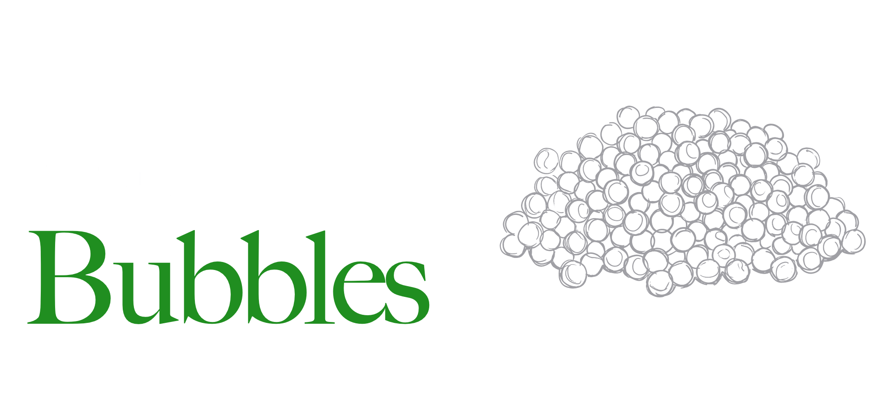

<p>
    <a href="charming_bubbles.png"></a><br>
    <a href="https://crates.io/crates/charming-bubbles"></a>
</p>

# Charming Bubbles (`charming-bubbles`)

**Charming Bubbles** is a complete, from-scratch Rust port of [Bubbles](https://github.com/charmbracelet/bubbles), the library of common UI components for Bubble Tea — text inputs, text areas, spinners, stopwatches, file pickers, help views, viewports and more. It tracks upstream Go releases on a rolling basis — this crate mirrors upstream `v2.1.0` — with a hard goal of **1:1 behavioral and visual parity**, favoring fidelity to upstream over Rust-native rewrites whenever the two would diverge.

It's part of the Charming port family of the Bubble Tea ecosystem and builds on [charming-bubbletea](https://github.com/coderbants/charming-bubbletea), [charming-lipgloss](https://github.com/coderbants/charming-lipgloss) and [charming-ultraviolet](https://github.com/coderbants/charming-ultraviolet).

## Installation

```sh
cargo add charming-bubbles
```

## License

[MIT](LICENSE)
